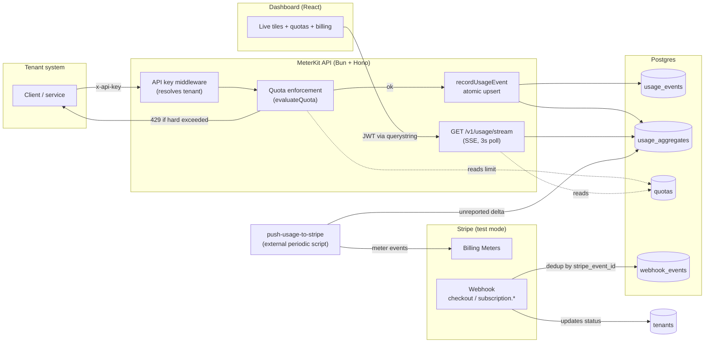
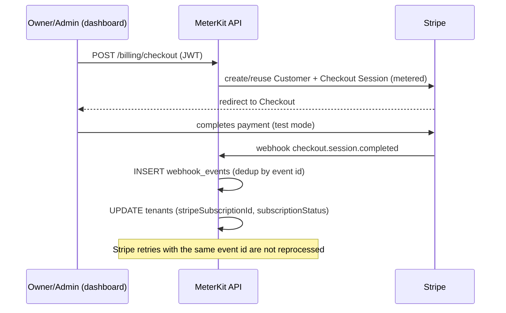

# MeterKit

Production-grade, multi-tenant SaaS starter that **meters consumption per tenant** (API
calls, LLM tokens, or any custom metric), **enforces quotas**, and **bills for usage** via
Stripe metered billing, with a real-time cost dashboard.

Portfolio project: it demonstrates the plumbing of a production SaaS — multi-tenancy with
test-verified isolation, role-based auth, efficient metering, quotas, idempotent webhooks,
and usage-based billing — without the complexity of a real product behind it.

## Scope (read this before comparing it to something else)

MeterKit is **metering + usage-based billing**: counting consumption, enforcing quotas,
reporting it to Stripe. It is **not** a dunning or failed-payment recovery tool. There are no
payment retry cascades, no recovery email generation, and no lease/reclaim idempotency engine
under concurrency. Stripe webhooks are deduplicated with a standard table
(`webhook_events`, unique on `stripe_event_id`) — basic good practice for any Stripe
integration, not a differentiator. See [DECISIONS.md](./DECISIONS.md) for the rest of the
design decisions and their rationale.

## Architecture



### Billing flow



## Stack

| Layer | Technology |
| --- | --- |
| Backend | Bun + Hono + Drizzle ORM + Postgres |
| Auth | JWT (jose, HS256) multi-role — owner/admin/member — + per-tenant API key |
| Billing | Stripe metered/usage-based billing + Billing Portal + Billing Meters (test mode) |
| Real-time | SSE (Server-Sent Events) |
| Frontend | React + Vite + TypeScript |
| Deploy | Railway (API + Postgres) + Vercel (dashboard) |
| CI | GitHub Actions — lint, typecheck, test (real Postgres), build |

## Structure

```
apps/
  api/    Bun + Hono + Drizzle — REST API, metering, quotas, Stripe, webhooks, SSE
  web/    Vite + React + TS — usage, quota and billing dashboard
```

## API surface

| Method | Route | Auth | Description |
| --- | --- | --- | --- |
| POST | `/auth/register` | — | Creates a new tenant and its owner user. Returns a JWT. |
| POST | `/auth/login` | — | Login. Returns a JWT. |
| GET | `/auth/me` | JWT | Authenticated user's profile + their tenant. |
| POST | `/auth/api-key` | JWT (owner/admin) | Rotates the tenant's API key (shown in plaintext only once). |
| POST | `/v1/usage` | API key (`x-api-key`) | Records a usage event; applies quota enforcement. |
| GET | `/v1/usage` | JWT | Daily aggregates by date range and `metric` (historical). |
| GET | `/v1/usage/stream` | JWT (header or `?token=`) | SSE with the current month's snapshot every 3s. |
| GET | `/quotas` | JWT | Lists the tenant's configured quotas. |
| POST | `/quotas` | JWT (owner/admin) | Creates or updates (upsert) a `metric`'s limit. |
| POST | `/billing/checkout` | JWT (owner/admin) | Opens a metered subscription Stripe Checkout session. |
| GET | `/billing/portal` | JWT (owner/admin) | Opens the tenant's Stripe Billing Portal. |
| POST | `/webhooks/stripe` | Stripe signature | Idempotent webhook (checkout, subscription.*). |
| GET | `/health` | — | Healthcheck. |

## Data model

`tenants`, `users`, `usage_events`, `usage_aggregates` (+ `cost_total`, `stripe_pushed_total`),
`quotas`, `webhook_events`. See the full, commented schema in
[`apps/api/src/db/schema.ts`](apps/api/src/db/schema.ts).

## Local development

Requirements: [Bun](https://bun.sh) ≥ 1.3, Docker (for Postgres).

```bash
cp .env.example .env               # fill in values (see comments in the file)
cp apps/web/.env.example apps/web/.env   # optional locally, required on Vercel
docker compose up -d               # starts Postgres on localhost:5432
bun install
bun run db:migrate                 # applies apps/api migrations
bun run db:seed                    # optional: 3 demo tenants with simulated usage
bun run dev:api                    # API at http://localhost:3000
bun run dev:web                    # dashboard at http://localhost:5173
```

`bun run db:seed` prints to the console the email/password and plaintext API key for each
demo tenant (Acme Inc, Globex Corp, Initech) — shown only once, just like in production.

### Configuring Stripe (test mode)

1. Create a product with a **metered price** (usage-based) in the Stripe dashboard (test
   mode) and copy its `price_id` to `STRIPE_METERED_PRICE_ID`.
2. Create a **Billing Meter** for each `metric` you bill (e.g. `api_calls`, `tokens`), with
   `event_name` **matching the metric name exactly** — this is the convention
   `push-usage-to-stripe` uses to report consumption.
3. Using the [Stripe CLI](https://stripe.com/docs/stripe-cli), listen for webhooks locally
   and copy the `whsec_...` it gives you to `STRIPE_WEBHOOK_SECRET`:
   ```bash
   stripe listen --forward-to localhost:3000/webhooks/stripe
   ```
4. Copy your test secret key to `STRIPE_SECRET_KEY`.

## Scripts (root)

| Script | Description |
| --- | --- |
| `bun run dev:api` / `dev:web` | API / dashboard in development mode |
| `bun run test` | Tests across all workspaces |
| `bun run typecheck` | `tsc --noEmit` across all workspaces |
| `bun run lint` / `lint:fix` | Biome (lint + format) |
| `bun run build` | Production build of the API and dashboard |
| `bun run db:migrate` | Applies Drizzle migrations against `DATABASE_URL` |
| `bun run db:seed` | Creates demo tenants with simulated usage |
| `bun --cwd apps/api run push-usage` | Reports unreported consumption to Stripe (see [DECISIONS.md](./DECISIONS.md)) |

## Tests

```bash
docker compose up -d
bun run db:migrate
bun run test
```

- **Unit** (no database): `evaluateQuota` (quota enforcement), period truncation,
  auth primitives (password/JWT/API key).
- **Integration** (against real Postgres): multi-tenant isolation, RBAC, aggregation under
  concurrent writes, end-to-end quota enforcement, webhook idempotency, SSE.

CI (`.github/workflows/ci.yml`) spins up a Postgres container and runs the full suite on
every push/PR.

## Deployment

- **API + Postgres → Railway**: create a Postgres service and a service for `apps/api`
  (`bun run start`, after `bun run db:migrate`). Environment variables: the ones from
  `.env.example`.
- **Dashboard → Vercel**: build `apps/web` (`vite build`), with `VITE_API_BASE_URL`
  pointing to the API's public URL on Railway.
- On the API, `APP_BASE_URL` must point to the dashboard's URL on Vercel (used for CORS and
  for Stripe Checkout/Portal redirects).
- `bun --cwd apps/api run push-usage` must be scheduled as an external cron job (Railway
  cron job or GitHub Actions `schedule`) — it does not run as a persistent process, see
  [DECISIONS.md](./DECISIONS.md).

## Project status

- [x] Milestone 1 — Scaffolding, Drizzle schema, docker-compose, CI
- [x] Milestone 2 — Auth (JWT, RBAC, API key), tenant isolation
- [x] Milestone 3 — Metering (`POST`/`GET /v1/usage`, aggregation)
- [x] Milestone 4 — Quotas (soft/hard enforcement)
- [x] Milestone 5 — Stripe (checkout, portal, usage push, webhooks)
- [x] Milestone 6 — Real-time dashboard (SSE) + seed
- [x] Milestone 7 — README + diagram + `DECISIONS.md`
