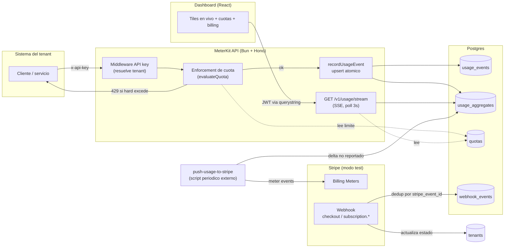
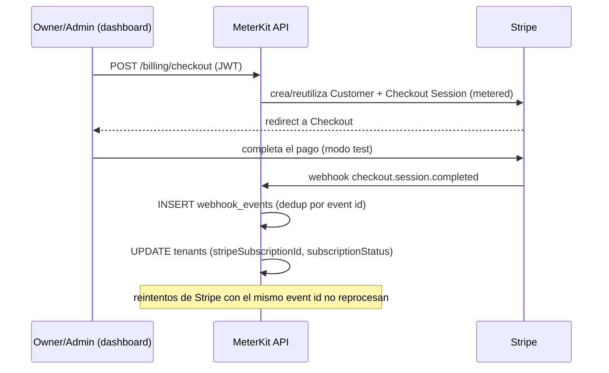

# MeterKit

Starter SaaS multi-tenant, de nivel produccion, que **mide consumo por tenant** (llamadas a
API, tokens de LLM, o cualquier metric propio), **aplica cuotas** y **factura por uso** vía
Stripe metered billing, con un dashboard de coste en tiempo real.

Proyecto de portfolio: demuestra la fontaneria de un SaaS de produccion — multi-tenancy con
aislamiento verificado por tests, auth por roles, metering eficiente, cuotas, webhooks
idempotentes y billing por uso — sin la complejidad de un producto real detras.

## Alcance (léelo antes de comparar con otra cosa)

MeterKit es **metering + usage-based billing**: contar consumo, aplicar cuotas, reportarlo a
Stripe. **No** es una herramienta de dunning ni de recuperación de pagos fallidos. No hay
cascadas de reintento de cobro, ni generación de emails de recuperación, ni un motor de
idempotencia con lease/reclaim bajo concurrencia. Los webhooks de Stripe se deduplican con
una tabla estándar (`webhook_events`, único por `stripe_event_id`) — buena práctica básica de
cualquier integración con Stripe, no un diferencial. Ver [DECISIONS.md](./DECISIONS.md) para
el resto de decisiones de diseño y sus porqués.

## Arquitectura



### Flujo de billing



## Stack

| Capa | Tecnologia |
| --- | --- |
| Backend | Bun + Hono + Drizzle ORM + Postgres |
| Auth | JWT (jose, HS256) multi-role — owner/admin/member — + API key por tenant |
| Billing | Stripe metered/usage-based billing + Billing Portal + Billing Meters (modo test) |
| Real-time | SSE (Server-Sent Events) |
| Frontend | React + Vite + TypeScript |
| Deploy | Railway (API + Postgres) + Vercel (dashboard) |
| CI | GitHub Actions — lint, typecheck, test (Postgres real), build |

## Estructura

```
apps/
  api/    Bun + Hono + Drizzle — API REST, metering, cuotas, Stripe, webhooks, SSE
  web/    Vite + React + TS — dashboard de uso, cuotas y facturación
```

## Superficie de la API

| Metodo | Ruta | Auth | Descripcion |
| --- | --- | --- | --- |
| POST | `/auth/register` | — | Crea un tenant nuevo y su usuario owner. Devuelve JWT. |
| POST | `/auth/login` | — | Login. Devuelve JWT. |
| GET | `/auth/me` | JWT | Perfil del usuario autenticado + su tenant. |
| POST | `/auth/api-key` | JWT (owner/admin) | Rota la API key del tenant (se muestra en claro una única vez). |
| POST | `/v1/usage` | API key (`x-api-key`) | Registra un evento de uso; aplica enforcement de cuota. |
| GET | `/v1/usage` | JWT | Agregados diarios por rango de fechas y `metric` (histórico). |
| GET | `/v1/usage/stream` | JWT (header o `?token=`) | SSE con el snapshot del mes en curso cada 3s. |
| GET | `/quotas` | JWT | Lista las cuotas configuradas del tenant. |
| POST | `/quotas` | JWT (owner/admin) | Crea o actualiza (upsert) el límite de un `metric`. |
| POST | `/billing/checkout` | JWT (owner/admin) | Abre un Stripe Checkout de suscripción metered. |
| GET | `/billing/portal` | JWT (owner/admin) | Abre el Stripe Billing Portal del tenant. |
| POST | `/webhooks/stripe` | Firma de Stripe | Webhook idempotente (checkout, subscription.*). |
| GET | `/health` | — | Healthcheck. |

## Modelo de datos

`tenants`, `users`, `usage_events`, `usage_aggregates` (+ `cost_total`, `stripe_pushed_total`),
`quotas`, `webhook_events`. Ver el esquema completo y comentado en
[`apps/api/src/db/schema.ts`](apps/api/src/db/schema.ts).

## Desarrollo local

Requisitos: [Bun](https://bun.sh) ≥ 1.3, Docker (para Postgres).

```bash
cp .env.example .env               # completar valores (ver comentarios en el archivo)
cp apps/web/.env.example apps/web/.env   # opcional en local, necesario en Vercel
docker compose up -d               # levanta Postgres en localhost:5432
bun install
bun run db:migrate                 # aplica las migraciones de apps/api
bun run db:seed                    # opcional: 3 tenants de demo con uso simulado
bun run dev:api                    # API en http://localhost:3000
bun run dev:web                    # dashboard en http://localhost:5173
```

`bun run db:seed` imprime por consola el email/contraseña y la API key en claro de cada
tenant de demo (Acme Inc, Globex Corp, Initech) — solo se muestra una vez, igual que en
producción.

### Configurar Stripe (modo test)

1. Crea un producto con un **precio metered** (usage-based) en el dashboard de Stripe (modo
   test) y copia su `price_id` a `STRIPE_METERED_PRICE_ID`.
2. Crea un **Billing Meter** por cada `metric` que factures (p. ej. `api_calls`, `tokens`),
   con `event_name` **igual al nombre del metric** — es la convención que usa
   `push-usage-to-stripe` para reportar consumo.
3. Con la [Stripe CLI](https://stripe.com/docs/stripe-cli), escucha webhooks localmente y
   copia el `whsec_...` que te da a `STRIPE_WEBHOOK_SECRET`:
   ```bash
   stripe listen --forward-to localhost:3000/webhooks/stripe
   ```
4. Copia tu clave secreta de test a `STRIPE_SECRET_KEY`.

## Scripts (raíz)

| Script | Descripción |
| --- | --- |
| `bun run dev:api` / `dev:web` | API / dashboard en modo desarrollo |
| `bun run test` | Tests de todos los workspaces |
| `bun run typecheck` | `tsc --noEmit` en todos los workspaces |
| `bun run lint` / `lint:fix` | Biome (lint + formato) |
| `bun run build` | Build de producción de API y dashboard |
| `bun run db:migrate` | Aplica migraciones Drizzle contra `DATABASE_URL` |
| `bun run db:seed` | Crea tenants de demo con uso simulado |
| `bun --cwd apps/api run push-usage` | Reporta a Stripe el consumo aún no informado (ver [DECISIONS.md](./DECISIONS.md)) |

## Tests

```bash
docker compose up -d
bun run db:migrate
bun run test
```

- **Unit** (sin base de datos): `evaluateQuota` (enforcement de cuota), truncado de periodos,
  primitivas de auth (password/JWT/API key).
- **Integración** (contra Postgres real): aislamiento multi-tenant, RBAC, agregación bajo
  escritura concurrente, enforcement de cuota end-to-end, idempotencia de webhooks, SSE.

CI (`.github/workflows/ci.yml`) levanta un contenedor de Postgres y corre la suite completa
en cada push/PR.

## Deploy

- **API + Postgres → Railway**: crea un servicio Postgres y un servicio para `apps/api`
  (`bun run start`, tras `bun run db:migrate`). Variables de entorno: las de `.env.example`.
- **Dashboard → Vercel**: build de `apps/web` (`vite build`), con `VITE_API_BASE_URL`
  apuntando a la URL pública de la API en Railway.
- En la API, `APP_BASE_URL` debe apuntar a la URL del dashboard en Vercel (se usa para CORS y
  para las redirecciones de Stripe Checkout/Portal).
- `bun --cwd apps/api run push-usage` debe programarse como cron externo (Railway cron job o
  GitHub Actions `schedule`) — no corre como proceso persistente, ver
  [DECISIONS.md](./DECISIONS.md).

## Estado del proyecto

- [x] Hito 1 — Scaffolding, schema Drizzle, docker-compose, CI
- [x] Hito 2 — Auth (JWT, RBAC, API key), aislamiento de tenant
- [x] Hito 3 — Metering (`POST`/`GET /v1/usage`, agregación)
- [x] Hito 4 — Cuotas (soft/hard enforcement)
- [x] Hito 5 — Stripe (checkout, portal, push de usage, webhooks)
- [x] Hito 6 — Dashboard real-time (SSE) + seed
- [x] Hito 7 — README + diagrama + `DECISIONS.md`
